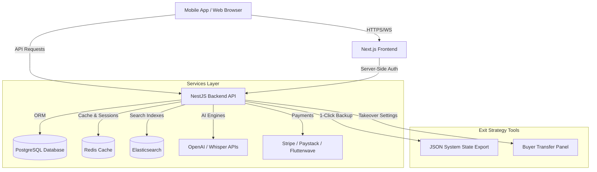

# HearBridge AI

### The World's First AI-Powered "Duolingo for Hearing & Speech Rehabilitation"

HearBridge AI is an enterprise-grade, commercial-ready SaaS platform built for deaf individuals receiving hearing aids, cochlear implant recipients, hard-of-hearing individuals, speech rehabilitation patients, and clinical teams (audiologists, speech therapists, hospitals, and educational institutions).

Designed as a turnkey software business, HearBridge AI integrates a **Next.js Web Portal**, a **NestJS REST API**, and a **Flutter Mobile App** with built-in white-labeling, automated system backups, licensing locks, and a **Buyer Transfer Panel** that enables immediate ownership handover without code changes.

---

## 🚀 Key Value Propositions

* **"Duolingo for Hearing"**: Gamified rehabilitation games, speech feedback visualizers, and milestones tracking to accelerate patient auditory adaptation.
* **Clinic Multi-Tenancy**: White-label customizers allowing hospitals and schools to swap logos, colors, domains, and SMTP relays.
* **Turnkey Handover Engine**: A Super Admin "Buyer Transfer Panel" designed to easily transfer payment bindings, email domains, database states, and credentials to a corporate buyer.
* **Modern Technology Stack**: Built using Next.js, NestJS, Prisma, PostgreSQL, Redis, Elasticsearch, Docker, and Flutter.

---

## 🛠️ System Architecture



---

## 📦 Project Modules

### 1. Sound Recognition Training
- **Auditory Games**: 7 sound categories (Home, Nature, Animals, Emergency, etc.) with custom sound clips.
- **Progress Tracking**: XP, Levels, and Badges progression system. Adaptive difficulty settings (Beginner, Intermediate, Advanced).

### 2. AI Speech Coach
- **Visual Mouth Placement Guides**: Canvas-animated guides for lips, teeth, and tongue coordinates depending on selected vowels (e.g. "AH", "EE", "OO").
- **Pronunciation Assessment**: Micro-microphone recorders evaluating clarity, volume, confidence, and pitch matching.

### 3. Listening Comprehension
- Play audio clips with adaptive questionnaires to verify comprehension, tracking accuracy and response times.

### 4. Real-World Sound Detector
- Web-audio-driven background detector identifying home doorbells, sirens, barking dogs, and crying babies, outputting urgency alerts with color-coded safety indicators.

### 5. Live Conversation Assistant
- Real-time subtitle transcription stream with speaker tags, slow playback speeds for auditory training, and log storage downloads.

### 6. AI Tutor Avatar
- Interactive animated face illustrating speech postures, leading rehab lessons, and offering encouragement.

### 7. Rehabilitation Journey Timeline
- A vertical timeline displaying rehab milestones (e.g. Day 1: doorbell detected, Day 15: speech test passed) with PDF summary export.

### 8. Therapist Portal
- Manage patient lists, assign workout schedules, review audio waveforms, and configure custom exercises.

### 9. Reporting System
- Interactive analytics on pronunciation improvements and listening accuracy with PDF/CSV exports.

### 10. Multi-Tenant Billing & White-Labeling
- Unified billing management supporting Stripe, Paystack, and Flutterwave. Dynamic color configurations that update user interfaces at runtime.

---

## 📂 Project Directory Structure

```bash
HearBridge-AI/
├── backend/                   # NestJS REST API Server
│   ├── prisma/                # Database schemas & migrations
│   ├── src/
│   │   ├── modules/
│   │   │   ├── auth/          # JWT, Roles Guards, Google SSO
│   │   │   ├── whitelabel/    # Tenant theme and colors manager
│   │   │   └── system/        # Backups, License checking & Handover
│   │   └── main.ts            # Entrypoint bootstrap
│   └── Dockerfile
├── frontend/                  # Next.js Web Portal
│   ├── app/
│   │   ├── page.tsx           # SaaS Landing & Sandbox Panel
│   │   └── dashboard/         # Unified Patient, Therapist & Admin portals
│   ├── styles/globals.css     # Dark mode & HSL design system
│   └── Dockerfile
├── mobile/                    # Flutter Mobile Codebase
│   ├── lib/
│   │   ├── screens/           # Speech Coach, Sound Alert and Timeline views
│   │   └── main.dart          # Navigation & Themes mapping
│   └── pubspec.yaml           # Packages config (TTS, STT, audioplayers)
├── docs/                      # Manuals library
│   ├── DEPLOYMENT.md          # Cloud infrastructure instructions
│   ├── ADMIN_MANUAL.md        # Portal configurations guide
│   └── OWNERSHIP_TRANSFER.md  # Handover migration steps
└── docker-compose.yml         # Dev environment stack configurations
```

---

## ⚡ Quick Start Guide

### Prerequisites
* [Node.js v24+](https://nodejs.org)
* [Docker Desktop](https://www.docker.com/products/docker-desktop)
* [Flutter SDK](https://docs.flutter.dev/get-started/install)

### Running locally with Docker
To launch the entire platform stack (Postgres, Redis, Elasticsearch, API, and Frontend) in one command:

```bash
docker-compose up -d --build
```
Access the services at:
- **Next.js Web Portal**: `http://localhost:3000`
- **NestJS REST API**: `http://localhost:4000`

---

## 💼 Corporate Handover & Exit Strategy Settings

HearBridge AI is designed to be resold or acquired as a turnkey SaaS asset. 

### 1. The Buyer Transfer Panel
Accessible inside the **Super Admin Portal**, this panel lets the platform owner rotate administrative privileges without editing source code:
* **Stripe Secret Keys Rotation**: Instantly swap API endpoints to bind payments to the buyer's Stripe/Paystack accounts.
* **Credentials Takeover**: Rotates default password hashes and binds primary administrator access to the buyer's email.
* **Domain Configurations**: Updates database subdomain variables and SMTP relay paths to match the buyer's DNS maps.

### 2. 1-Click Backup & Restore
* **Backup**: Exports a single, structured, encrypted JSON file containing translations, user accounts, SoundLibrary contents, and clinical logs.
* **Restore**: Imports the JSON state file onto a new deployment node to populate the system database instantly.

---

## 🔒 Security & HIPAA Compliance
- **HIPAA Ready**: Structured separation of Patient Health Information (PHI) logs and user logins.
- **RBAC**: Multi-role route protectors separating Patient, Therapist, Org Admin, and Super Admin scopes.
- **Audit Logs**: Database tracking for sensitive operations, backups, database updates, and credentials rotation.